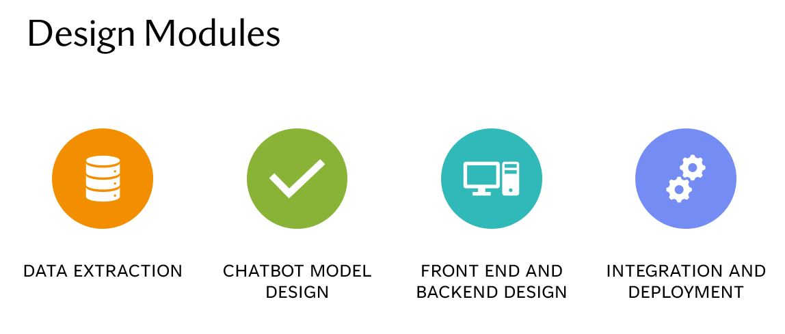
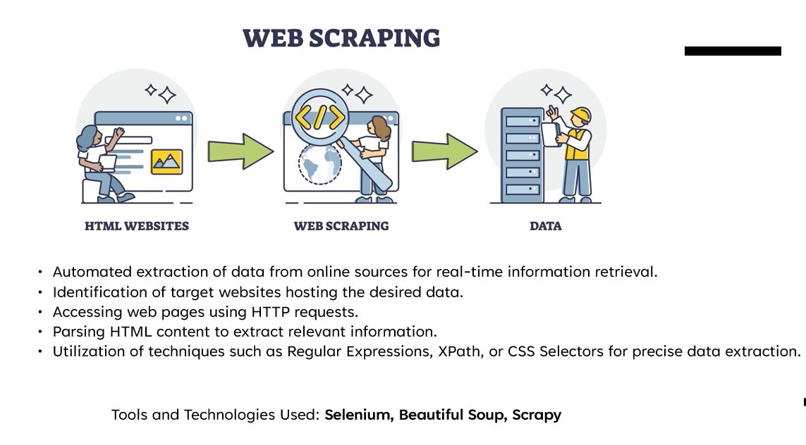
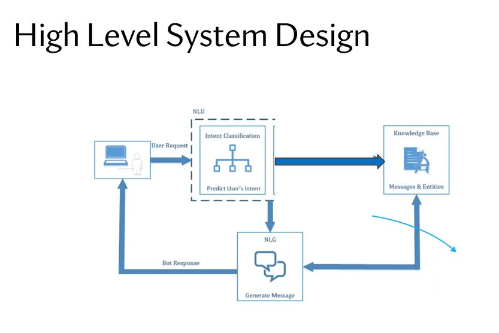

# Breast Cancer Chatbot Project

This repository contains code for a Breast Cancer Chatbot. The chatbot uses pre-trained transformer models to classify and respond to user queries related to breast cancer.

## Features

- Data preprocessing and exploratory data analysis (EDA)
- Custom tokenizer and transformer models (BERT, DistilBERT, Electra)
- Training, evaluation, and metrics computation
- Save and load models using pickle
- Generate predictions with pre-trained models

## Requirements

Before running the project, ensure the following dependencies are installed:

- Python 3.8+
- TensorFlow
- PyTorch
- Transformers
- Keras
- Pandas
- NumPy
- Scikit-learn
- Seaborn
- Matplotlib
- Missingno
- WordCloud
- NLTK

## Dataset

The project uses the **Breast Cancer Chatbot Dataset**, which should be available in the same directory as this `README.md` file, named `BreastCancerChatbotDataset.csv`.

## Project Setup

### 1. Clone the Repository
```bash
git clone <repository_url>
cd <repository_name>
```

### 2. Install Dependencies
Use the following command to install all required dependencies:
```bash
pip install -r requirements.txt
```

### 3. Data Preprocessing
The dataset is cleaned, preprocessed, and split into train/test datasets. Missing values are removed, and patterns are tokenized.

### 4. Train Transformer Models
The project supports training and evaluation of models like BERT, DistilBERT, and Electra.

- Train models using the `Trainer` API from the `transformers` library.

### 5. Save and Load Models
- Models and tokenizers are serialized using Pickle for future use.

## Key Files

- `BreastCancerChatbotDataset.csv`: Input dataset for training the chatbot.
- `chatbot.pkl` & `chatbot_model_distill.pkl`: Saved models and tokenizers.
- `README.md`: Documentation for the project.

## How to Use

### 1. Train the Model
Run the training code block to fine-tune the transformer models on the dataset.

### 2. Evaluate the Model
The project includes evaluation metrics such as accuracy, precision, recall, and F1-score.

### 3. Make Predictions
```python
text = "What are the symptoms of breast cancer?"
predicted_label = chatbot(text)
print(predicted_label)
```

### 4. Save and Load Models
The model and tokenizer are saved as pickle files for reusability:
```python
pickle_file_path = 'chatbot.pkl'
with open(pickle_file_path, 'wb') as pickle_file:
    pickle.dump({'model': model, 'tokenizer': tokenizer}, pickle_file)
```

To load the saved models:
```python
with open(pickle_file_path, 'rb') as pickle_file:
    loaded_model_tokenizer_dict = pickle.load(pickle_file)
chatbot = pipeline("sentiment-analysis", model=loaded_model, tokenizer=loaded_tokenizer)
```

## Visualization

- Word clouds for patterns
- Class distribution plots
- Average word length and text statistics

## Design Modules

{width=100% height=350}

### 1. Data Extraction
   - Used Selenium, Beautiful Soup, and Scrapy for real-time data extraction from reputable medical websites like Medscape, Medline, American Cancer Society, and CDC.
   - Extracted data in a structured format: `Question | Answer | Patterns | Tags | Source`.

{width=100% height=350}

### 2. Chatbot Model Design
   - Implemented intent classification using transformers like BERT, RoBERTa, and ALBERT to understand and generate human-like language responses.

{width=100% height=350}

### 3. Front End and Backend Design
   - Developed a user-friendly chat interface using Streamlit.
   - Provided a text input box, message display area, scrolling functionality, and UI elements for interaction.

### 4. Integration and Deployment
   - Deployed the project using Streamlit to create and share the web app easily.

### Intent Classification
   - Leveraged advanced techniques such as transformers (BERT, RoBERTa, ALBERT) to interpret the user's intent and generate accurate responses.

## Contribution

Contributions are welcome! Feel free to submit a pull request or report issues in the Issues tab.

## License

This project is licensed under the MIT License. See the LICENSE file for more details.